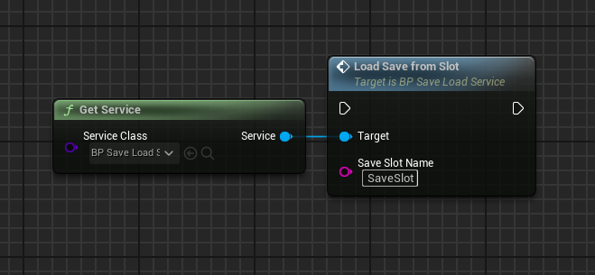

# Game Instance Services
Service is singleton with GameInstance's lifetime.  
They can be implemented by C++ and Blueprints out of box easily.  
 

 
Services useful to separate logic from GameInstance to their own classes.
 

Let's say you have SaveLoad System, Auth Logic and maybe some statistic methods and all this implemented at GameInstance class and it's grown over and over. 
Separate their to own classes is a good practice.  
You can choose GameInstanceSubsystem, and usualy it's enought. 
And Game Instance Services is your choice if you want: 
1. Easialy implement service as Blueprint.  
2. Make relationships between services.  
 

# Game Instance Services lifetime
Service initialized when created. 
Because service is singleton it's created once on first access to it (GetService func). 
If you want to start service when GameInstance started - just add service class to "Startup Services" at "Project Settings" -> "Services Subsystem Settings" 
Use PostStartup func if your services depends on each other - it's called once whan all "Startup Services" are created and initialized. 